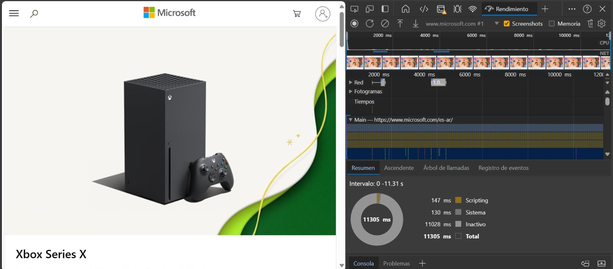
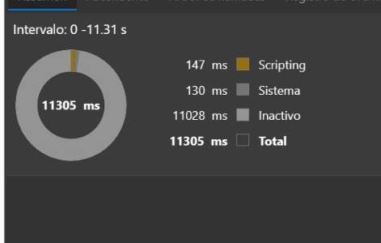

# Construyendo una extensión de navegador

# Clase 13 -  Navegadores

Crear extensiones de navegador es una forma divertida e interesante de pensar en el rendimiento de sus aplicaciones mientras crea un tipo diferente de activo web. Este módulo incluye lecciones sobre cómo funcionan los navegadores y cómo implementar una extensión de navegador, cómo crear un formulario, llamar a una API y utilizar el almacenamiento local, y cómo medir el rendimiento de su sitio web y mejorarlo.

Crearás una extensión de navegador que funcione en Edge, Chrome y Firefox. Esta extensión, que es como un mini sitio web diseñado para una tarea muy específica, verifica la API de señal de C02 para determinar el uso de electricidad y la intensidad de carbono de una región determinada, y devuelve una lectura sobre la huella de carbono de la región.

Un usuario puede llamar a esta extensión ad hoc una vez que se ingresa una clave API y un código de región en un formulario para determinar el uso de electricidad local y, por lo tanto, ofrecer datos que pueden influir en las decisiones de electricidad de un usuario. Por ejemplo, puede ser preferible retrasar el funcionamiento de una secadora de ropa (una actividad que genera intensas emisiones de carbono) durante un período de alto uso de electricidad en su región.

## Temas

- Sobre el navegador
- Formularios y almacenamiento local
- Tareas en segundo plano y rendimiento.

### Introducción

Las extensiones del navegador agregan funcionalidad adicional a un navegador. Pero antes de crear uno, debe aprender un poco sobre cómo funcionan los navegadores.

### Sobre el navegador

En esta serie de lecciones, aprenderemos a crear una extensión de navegador que funcionará en los navegadores Chrome, Firefox y Edge. En esta parte, descubriremos cómo funcionan los navegadores y desarrollará los elementos de la extensión del navegador.

Pero, ¿qué es exactamente un navegador? Es una aplicación de software que permite a un usuario final acceder al contenido de un servidor y mostrarlo en páginas web.

✅Un poco de historia: el primer navegador se llamó 'WorldWideWeb' y fue creado por Sir Timothy Berners-Lee en 1990.


Cuando un usuario se conecta a Internet usando una dirección URL (Localizador uniforme de recursos), generalmente usando el Protocolo de transferencia de hipertexto a través de una dirección `http`o `https`, el navegador se comunica con un servidor web y obtiene una página web.

En este punto, el motor de representación del navegador lo muestra en el dispositivo del usuario, que puede ser un teléfono móvil, una computadora de escritorio o una computadora portátil.

Los navegadores también tienen la capacidad de almacenar contenido en caché para que no tenga que recuperarse del servidor cada vez. Pueden registrar el historial de la actividad de navegación de un usuario, almacenar 'cookies', que son pequeños fragmentos de datos que contienen información utilizada para almacenar la actividad de un usuario, y más.

Una cosa realmente importante para recordar acerca de los navegadores es que no todos son iguales. Cada navegador tiene sus fortalezas y debilidades, y un desarrollador web profesional debe comprender cómo hacer que las páginas web funcionen bien en todos los navegadores. Esto incluye el manejo de ventanas de visualización pequeñas, como las de un teléfono móvil, así como un usuario que no esté conectado.

Un sitio web realmente útil que probablemente debería marcar en cualquier navegador que prefiera usar es caniuse.com . Cuando está creando páginas web, es muy útil utilizar las listas de tecnologías compatibles de caniuse para que pueda ayudar mejor a sus usuarios.

## extensiones del navegador

¿Por qué querrías construir una extensión de navegador? Es útil adjuntarlo a su navegador cuando necesita un acceso rápido a las tareas que tiende a repetir. Por ejemplo, si necesita verificar los colores en las diversas páginas web con las que interactúa, puede instalar una extensión de navegador de selección de colores. Si tiene problemas para recordar las contraseñas, puede usar una extensión de navegador de administración de contraseñas.

Las extensiones de navegador también son divertidas de desarrollar. Suelen gestionar un número finito de tareas que realizan bien.

### Instalación de extensiones

Antes de comenzar a crear, puede ver un poco sobre el proceso de creación e implementación de una extensión de navegador. Si bien cada navegador varía un poco en la forma en que administra esta tarea, el proceso es similar en Chrome y Firefox a este ejemplo en Edge.

- [Crear e implementar extensiones](https://support.google.com/chrome/a/answer/2714278?hl=es)

### Empezar

Vas a construir una extensión de navegador que muestre la huella de carbono de tu región, mostrando el uso de energía de tu región y la fuente de la energía. La extensión tendrá un formulario que recopila una clave API para que pueda acceder a la API de CO2 Signal.

**Necesitas:**

- [una clave API](https://www.co2signal.com/)
    
    ingrese su correo electrónico en el cuadro de esta página y se le enviará uno
    
- [código de tu región](http://api.electricitymap.org/v3/zones) - [Electricity Map](https://www.electricitymap.org/map)
    
    correspondiente(en Argentina, por ejemplo, uso 'AR').
    
- `Comienzo`
    
    - Breve descripción de cómo comenzar con nuestro proyecto.
    
- [NPM](https://www.npmjs.com/)`package.json`
    
    - NPM es una herramienta de gestión de paquetes; instálelo localmente y los paquetes enumerados en su archivo se instalarán para que los use su activo web. 

**Tómate un minuto para visualizar el código base:**

- dist
    - manifest.json (los valores predeterminados se establecen aquí)
    - index.html (frontend HTML)
    - background.js ( JS de fondo)
    - main.js (JS creado)
- src
    - index.js (Tu código JS va aquí)

## Construya el HTML para la extensión ##

Esta extensión tiene dos vistas. Uno para recopilar la clave API y el código de región. Y el segundo para mostrar el uso de carbono de la región. Comencemos construyendo el HTML para el formulario y estilizándolo con CSS.

En la `/dist` carpeta, creará un formulario y un área de resultados. En el `index.html` archivo, complete el área de formulario delineada:

```HTML
<form class="form-data" autocomplete="on">
	<div>
		<h2>Nuevo? Añade tu información</h2>
	</div>
	<div>
		<label for="region">Región</label>
		<input type="text" id="region" required class="region-name" />
	</div>
	<div>
		<label for="api">Tu API Key</label>
		<input type="text" id="api" required class="api-key" />
	</div>
	<button class="search-btn">Submit</button>
</form>	
```

En este punto, puedes probar una compilación. Asegúrese de instalar las dependencias del paquete de esta extensión:

`npm install`

Este comando utilizará npm, el Administrador de paquetes de nodo, para instalar el paquete web para el proceso de compilación de su extensión. Webpack es un paquete que se encarga de compilar código. Puede ver el resultado de este proceso mirando hacia adentro `/dist/main.js`; verá que el código se ha incluido.

# Parte 2: llame a una API, use almacenamiento local #

## Introducción ##

En esta lección, llamará a una API enviando el formulario de la extensión de su navegador y mostrando los resultados en la extensión de su navegador. Además, aprenderá cómo almacenar datos en el almacenamiento local de su navegador para referencia y uso futuros.

## Configure los elementos para manipular en la extensión: ##

 En este momento, habrá creado el HTML para el formulario y los resultados `<div>` de la extensión de su navegador. De ahora en adelante, necesitarás trabajar en el archivo `/src/index.js`y construir tu extensión poco a poco. 

Trabajando en su archivo `index.js`, comience creando algunas variables `const` para contener los valores asociados con varios campos.

```Javascript
// Campo del formulario
const form = document.querySelector('.form-data');
const region = document.querySelector('.region-name');
const apiKey = document.querySelector('.api-key');

// resultados
const errors = document.querySelector('.errors');
const loading = document.querySelector('.loading');
const results = document.querySelector('.result-container');
const usage = document.querySelector('.carbon-usage');
const fossilfuel = document.querySelector('.fossil-fuel');
const myregion = document.querySelector('.my-region');
const clearBtn = document.querySelector('.clear-btn');
```

## Agregar oyentes ##

A continuación, agregue detectores de eventos al formulario y el botón de borrar que restablece el formulario, de modo que si un usuario envía el formulario o hace clic en ese botón de reinicio, algo sucederá y agregue la llamada para inicializar la aplicación en la parte inferior del archivo:

```Javascript
form.addEventListener('submit', (e) => handleSubmit(e));
clearBtn.addEventListener('click', (e) => reset(e));
init();
```

## Desarrolle la función init() y la función reset() ##

Ahora vas a construir la función que inicializa la extensión, que se llama init():

```JavaScript
function init() {
	//Si hay algo en el almacenamiento local, tómalo.
	const storedApiKey = localStorage.getItem('apiKey');
	const storedRegion = localStorage.getItem('regionName');

	//configurar el icono para que sea verde genérico
	chrome.runtime.sendMessage({
		action: 'updateIcon',
		value: {
			color: 'green',
		},
	});

	if (storedApiKey === null || storedRegion === null) {
		//si no tenemos la key mostrar el formulario
		form.style.display = 'block';
		results.style.display = 'none';
		loading.style.display = 'none';
		clearBtn.style.display = 'none';
		errors.textContent = '';
	} else {
        //Si hemos guardado claves/regiones en localStorage, mostraremos los resultados cuando se carguen.
        displayCarbonUsage(storedApiKey, storedRegion);
		results.style.display = 'none';
		form.style.display = 'none';
		clearBtn.style.display = 'block';
	}
};

function reset(e) {
	e.preventDefault();
	//borrar el almacenamiento local solo para la región
	localStorage.removeItem('regionName');
	init();
}

```


📢 En esta función hay una lógica interesante. Al leerlo, ¿puedes ver lo que sucede?

 - Dos `const` están configurados para verificar si el usuario ha almacenado una clave API y un código de región en el almacenamiento local.
 - Si alguno de ellos es nulo, muestre el formulario cambiando su estilo para mostrarlo como 'bloque'
 - Oculte los resultados, la carga y clearBtn y establezca cualquier texto de error en una cadena vacía.
 - Si existe una clave y una región, inicie una rutina para:
    - Llame a la API para obtener datos sobre el uso de carbono.
    - ocultar el área de resultados
    - ocultar el formulario
    - muestra el botón de reinicio

Antes de continuar, es útil conocer un concepto muy importante disponible en los navegadores: `LocalStorage`. LocalStorage es una forma útil de almacenar cadenas en el navegador como un par `key-value`. Este tipo de almacenamiento web puede ser manipulado por JavaScript para administrar datos en el navegador. LocalStorage no caduca, mientras que SessionStorage, otro tipo de almacenamiento web, se borra cuando se cierra el navegador. Los distintos tipos de almacenamiento tienen ventajas y desventajas en su uso.

```
Nota: la extensión de su navegador tiene su propio almacenamiento local; la ventana principal del navegador es una instancia diferente y se comporta por separado.
```
Usted configura su APIKey para que tenga un valor de cadena, por ejemplo, y puede ver que está configurado en Edge "inspeccionando" una página web (puede hacer clic derecho en un navegador para inspeccionar) y yendo a la pestaña Aplicaciones para ver la almacenamiento.

✅ Piensa en situaciones en las que NO desearías almacenar algunos datos en LocalStorage. En general, colocar claves API en LocalStorage es una mala idea. ¿Puedes ver por qué? En nuestro caso, dado que nuestra aplicación es puramente para aprendizaje y no se implementará en una tienda de aplicaciones, usaremos este método.

Tenga en cuenta que utiliza la API web para manipular LocalStorage, ya sea mediante getItem(), setItem()o removeItem(). Es ampliamente compatible con todos los navegadores.

Antes de crear la función `displayCarbonUsage()` que se llama en init(), creemos la funcionalidad para manejar el envío inicial del formulario.

## Manejar el envío del formulario ##

Cree una función llamada `handleSubmit` que acepte un argumento de evento (e). Detenga la propagación del evento (en este caso, queremos detener la actualización del navegador) y llame a una nueva función, `setUpUser` pasando los argumentos `apiKey.valuey` y `region.value`. De esta manera, utiliza los dos valores que se ingresan a través del formulario inicial cuando se completan los campos apropiados.

```javascript
    function handleSubmit(e) {
	e.preventDefault();
	setUpUser(apiKey.value, region.value);
}
```

✅ Refresque su memoria: el HTML que configuró en la última lección tiene dos campos de entrada que valuesse capturan a través del que constconfiguró en la parte superior del archivo, y ambos sirven requiredpara que el navegador impida que los usuarios ingresen valores nulos.

## Configurar el usuario ##

Pasando a la función `setUpUser`, aquí es donde configura los valores de almacenamiento local para `apiKey` y `regionName`. Agregar una nueva función:

```javascript
function setUpUser(apiKey, regionName) {
	localStorage.setItem('apiKey', apiKey);
	localStorage.setItem('regionName', regionName);
	loading.style.display = 'block';
	errors.textContent = '';
	clearBtn.style.display = 'block';
	//make initial call
	displayCarbonUsage(apiKey, regionName);
}

```
Esta función establece un mensaje de carga para mostrar mientras se llama a la API. ¡En este punto, ha llegado a crear la función más importante de esta extensión del navegador!

## Mostrar uso de carbono ##

¡Finalmente, es hora de consultar la API!

Antes de continuar, deberíamos analizar las API. `Las API`, o interfaces de programación de aplicaciones, son un elemento fundamental de la caja de herramientas de un desarrollador web. Proporcionan formas estándar para que los programas interactúen e interactúen entre sí. Por ejemplo, si está creando un sitio web que necesita consultar una base de datos, es posible que alguien haya creado una API para que la use. Si bien existen muchos tipos de API, una de las más populares es la `API REST`.

✅ El término 'REST' significa 'Transferencia de estado representacional' y presenta el uso de URL configuradas de diversas formas para recuperar datos. Investigue un poco sobre los distintos tipos de API disponibles para los desarrolladores. ¿Qué formato te atrae?

Hay cosas importantes a tener en cuenta sobre esta función. Primero, observe la palabra clave `async`. Escribir sus funciones para que se ejecuten de forma asincrónica significa que esperan a que se complete una acción, como la devolución de datos, antes de continuar.

**Cree una nueva función para consultar la API C02Signal** 

```javascript
import axios from 'axios';

async function displayCarbonUsage(apiKey, region) {
	try {
		await axios
			.get('https://api.co2signal.com/v1/latest', {
				params: {
					countryCode: region,
				},
				headers: {
					'auth-token': apiKey,
				},
			})
			.then((response) => {
				let CO2 = Math.floor(response.data.data.carbonIntensity);

				//calculateColor(CO2);

				loading.style.display = 'none';
				form.style.display = 'none';
				myregion.textContent = region;
				usage.textContent =
					Math.round(response.data.data.carbonIntensity) + ' grams (grams C02 emitted per kilowatt hour)';
				fossilfuel.textContent =
					response.data.data.fossilFuelPercentage.toFixed(2) +
					'% (percentage of fossil fuels used to generate electricity)';
				results.style.display = 'block';
			});
	} catch (error) {
		console.log(error);
		loading.style.display = 'none';
		results.style.display = 'none';
		errors.textContent = 'Sorry, we have no data for the region you have requested.';
	}
}

```

✅ Esta es una gran función. ¿Que está pasando aqui?

- Siguiendo las mejores prácticas, utiliza una palabra clave `async` para que esta función se comporte de forma asincrónica. La función contiene un bloque `try/catch`, ya que devolverá una promesa cuando la API devuelva datos. Debido a que no tiene control sobre la velocidad a la que responderá la API (¡puede que no responda en absoluto!), debe manejar esta incertidumbre llamándola de forma asincrónica.
- Está consultando la API de co2signal para obtener los datos de su región, utilizando su clave API. Para usar esa clave, debe usar un tipo de autenticación en los parámetros de su encabezado.
- Una vez que la API responde, usted asigna varios elementos de sus datos de respuesta a las partes de su pantalla que configuró para mostrar estos datos.
- Si hay un error, o si no hay resultado, muestra un mensaje de error.


## 🚀 Desafío ##

Hasta ahora, hemos analizado varios tipos de API en estas lecciones. Elija una API web e investigue en profundidad lo que ofrece. Por ejemplo, eche un vistazo a las API disponibles en los navegadores, como la `API HTML` de arrastrar y soltar . ¿Qué hace que una API sea excelente en tu opinión?


# Clase 14 - Tareas en segundo plano y rendimiento #

## Introducción ##

Hasta el momento aprendió cómo crear un formulario y un área de visualización para los datos obtenidos de una API. Es una forma muy estándar de crear una presencia en la web. Incluso aprendió a manejar la obtención de datos de forma asincrónica. La extensión de tu navegador está casi completa.

Queda por gestionar algunas tareas en segundo plano, incluida la actualización del color del icono de la extensión, por lo que este es un buen momento para hablar sobre cómo el navegador gestiona este tipo de tareas. Pensemos en estas tareas del navegador en el contexto del rendimiento de sus recursos web a medida que los crea.

## Conceptos básicos del rendimiento web ##

Como era de esperar, el tema de cómo hacer que sus sitios web sean increíblemente rápidos en todo tipo de dispositivos, para todo tipo de usuarios, en todo tipo de situaciones, es amplio. A continuación se incluyen algunos puntos que debe tener en cuenta al crear un proyecto web estándar o una extensión de navegador.

Lo primero que debe hacer para asegurarse de que su sitio funcione de manera eficiente es recopilar datos sobre su rendimiento. El primer lugar para hacer esto es en las herramientas de desarrollo de su navegador web. En Edge, puedes seleccionar el botón "Configuración y más" (el ícono de tres puntos en la parte superior derecha del navegador), luego navegar a Más herramientas > Herramientas de desarrollo y abrir la pestaña Rendimiento. También puedes usar los atajos de teclado Ctrl+ Shift+ Ien Windows o Option+ Command+ Ien Mac para abrir herramientas de desarrollador.

La pestaña Rendimiento contiene una herramienta de creación de perfiles. Abra un sitio web (pruebe, por ejemplo, https://www.microsoft.com ) y haga clic en el botón "Grabar", luego actualice el sitio. Detenga la grabación en cualquier momento y podrá ver las rutinas que se generan para 'guionar', 'renderizar' y 'pintar' el sitio.

 

Seleccione elementos de la línea de tiempo del perfil para ampliar los eventos que suceden mientras se carga su página.

Obtenga una instantánea del rendimiento de su página seleccionando una parte de la línea de tiempo del perfil y mirando el panel de resumen

 


 Consulte el panel Registro de eventos para ver si algún evento tardó más de 15 ms

## Comprobaciones de perfiles ##

En general, existen algunas "áreas problemáticas" que todo desarrollador web debe tener en cuenta al crear un sitio para evitar sorpresas desagradables cuando llegue el momento de implementarlo en producción.

Tamaño de los activos : La Web se ha vuelto "más pesada" y, por tanto, más lenta en los últimos años. Parte de este peso tiene que ver con el uso de imágenes.

**Recorridos DOM**: el navegador tiene que construir su modelo de objetos de documento en función del código que usted escribe, por lo que es beneficioso para el buen rendimiento de la página mantener sus etiquetas al mínimo, usando y diseñando solo lo que la página necesita. Hasta este punto, se podría optimizar el exceso de CSS asociado con una página; Los estilos que deben usarse solo en una página no necesitan incluirse en la hoja de estilos principal, por ejemplo.

**JavaScript**: todo desarrollador de JavaScript debe estar atento a los scripts de "bloqueo de renderizado" que deben cargarse antes de que el resto del DOM pueda atravesarse y pintarse en el navegador. Considere usarlo defercon sus scripts en línea (como se hace en el módulo Terrarium).

Ahora que tiene una idea de cómo el navegador representa los recursos que le envía, veamos las últimas cosas que debe hacer para completar su extensión:

Crear una función para calcular el color.
Trabajando en `/src/index.js`, agregue una función llamada `calculateColor()` después de la serie de `const` variables que configuró para obtener acceso al DOM:

```javascript
function calculateColor(value) {
	let co2Scale = [0, 150, 600, 750, 800];
	let colors = ['#2AA364', '#F5EB4D', '#9E4229', '#381D02', '#381D02'];

	let closestNum = co2Scale.sort((a, b) => {
		return Math.abs(a - value) - Math.abs(b - value);
	})[0];
	console.log(value + ' is closest to ' + closestNum);
	let num = (element) => element > closestNum;
	let scaleIndex = co2Scale.findIndex(num);

	let closestColor = colors[scaleIndex];
	console.log(scaleIndex, closestColor);

	chrome.runtime.sendMessage({ action: 'updateIcon', value: { color: closestColor } });
}

```

¿Que está pasando aqui? Pasa un valor (la intensidad de carbono) de la llamada API que completó en la última lección y luego calcula qué tan cerca está su valor del índice presentado en la matriz de colores. Luego envías el valor de color más cercano al tiempo de ejecución de Chrome.

chrome.runtime tiene una API que maneja todo tipo de tareas en segundo plano y su extensión la aprovecha:

```Nota:
"Utilice la API chrome.runtime para recuperar la página en segundo plano, devolver detalles sobre el manifiesto y escuchar y responder a eventos en el ciclo de vida de la aplicación o extensión. También puede utilizar esta API para convertir la ruta relativa de las URL a completamente calificada. URL."
```

✅ Si estás desarrollando esta extensión de navegador para Edge, puede que te sorprenda saber que estás utilizando una API de Chrome. Las versiones más nuevas del navegador Edge se ejecutan en el motor del navegador Chromium, por lo que puedes aprovechar estas herramientas.

Tenga en cuenta que si desea crear un perfil de una extensión del navegador, inicie las herramientas de desarrollo desde la propia extensión, ya que es su propia instancia de navegador independiente.

Establecer un color de icono predeterminado
Ahora, en la init()función, configure el ícono en verde genérico para comenzar llamando nuevamente a updateIconla acción de Chrome:

```javascript
chrome.runtime.sendMessage({
	action: 'updateIcon',
		value: {
			color: 'green',
		},
});
```

**Llame a la función, ejecute la llamada.**
A continuación, llame a esa función que acaba de crear agregándola a la promesa devuelta por la API C02Signal:

```javascript
//let CO2...
calculateColor(CO2);
```

Y finalmente, en `/dist/background.js`, agregue el oyente para estas llamadas a acciones en segundo plano:

```javascript
chrome.runtime.onMessage.addListener(function (msg, sender, sendResponse) {
	if (msg.action === 'updateIcon') {
		chrome.browserAction.setIcon({ imageData: drawIcon(msg.value) });
	}
});

function drawIcon(value) {
	let canvas = document.createElement('canvas');
	let context = canvas.getContext('2d');

	context.beginPath();
	context.fillStyle = value.color;
	context.arc(100, 100, 50, 0, 2 * Math.PI);
	context.fill();

	return context.getImageData(50, 50, 100, 100);
}
```

En este código, está agregando un detector para cualquier mensaje que llegue al administrador de tareas de backend. Si se llama `'updateIcon'`, entonces se ejecuta el siguiente código para dibujar un ícono del color adecuado usando la API de Canvas.

Ahora, reconstruya su extensión (npm run build), actualice e inicie su extensión y observe cómo cambia el color.
Felicitaciones, ha creado una extensión de navegador útil y ha aprendido más sobre cómo funciona el navegador y cómo perfilar su rendimiento.

# Felicidades, creaste tu primer extensión!! #